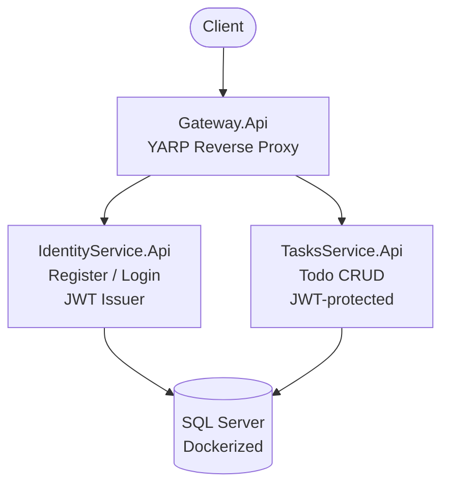

# TaskManagerAPI

[](https://github.com/LolghElmo/TaskManagerAPI/actions/workflows/CI.yml)


A microservices-based task management API built with **.NET 10**, designed as an exercise in applying real-world backend patterns: Clean Architecture, CQRS, JWT authentication, a reverse-proxy API gateway, containerized SQL Server, and full testing including integration tests with real databases via Testcontainers.

> This is my first end-to-end backend project built to learn, not copied from a template. Everything here (architecture decisions, test setup, CI, Docker wiring) was figured out step by step. The goal was to ship something that mirrors how a production service is actually structured, not a toy CRUD app.

---

## Table of Contents

- [Architecture](#architecture)
- [Tech Stack](#tech-stack)
- [Key Features](#key-features)
- [Project Structure](#project-structure)
- [API Reference](#api-reference)
- [Installation](#installation)
- [Running with Docker](#running-with-docker)
- [Testing](#testing)
- [CI/CD](#cicd)
- [What I Learned](#what-i-learned)
- [Roadmap](#roadmap)
- [Acknowledgements](#acknowledgements)

---

## Architecture

Three independently deployable services sit behind a YARP reverse-proxy gateway. Each service owns its own database and follows Clean Architecture (Domain -> Application -> Infrastructure -> Api).



Each service is layered:

- **Domain**: entities, interfaces, no external dependencies
- **Application**: CQRS handlers (MediatR), DTOs, validators, mapping profiles
- **Infrastructure**: EF Core `DbContext`, repositories, JWT provider, external service implementations
- **Api**: controllers, middleware, DI composition root

---

## Tech Stack

| Concern | Choice |
|---|---|
| Runtime | .NET 10 / C# 13 |
| API Gateway | YARP (Yet Another Reverse Proxy) |
| Auth | ASP.NET Core Identity + JWT Bearer |
| CQRS / Mediator | MediatR |
| Validation | FluentValidation |
| ORM | Entity Framework Core 10 |
| Database | SQL Server 2022 (containerized) |
| Mapping | AutoMapper |
| Logging | Serilog |
| API Docs | Scalar (OpenAPI) |
| Unit Tests | xUnit, Moq, FluentAssertions |
| Integration Tests | `WebApplicationFactory`, Testcontainers.MsSql |
| Build Automation | Nuke Build |
| CI | GitHub Actions |
| Containerization | Docker + Docker Compose |

---

## Key Features

- **Clean Architecture**: enforced per service. Domain has zero dependencies; Api depends on Application; Infrastructure plugs in at composition root.
- **CQRS with MediatR**: every use case is a `Command` or `Query` with its own handler. No fat controllers.
- **JWT authentication**: issued by `IdentityService`, consumed by `TasksService` through shared validation parameters.
- **FluentValidation pipeline**: requests validated before reaching handlers via a MediatR behavior.
- **Global exception handling**: using `IExceptionHandler` returning RFC 7807 `ProblemDetails`.
- **Pagination**: on list endpoints (`pageNumber`, `pageSize`) with total count metadata.
- **Result&lt;T&gt; pattern**: handlers return explicit success/failure instead of throwing for control flow.
- **Secrets management**: User Secrets for local dev, `.env` + `docker-compose.override.yml` for Docker; nothing sensitive committed.
- **Fail-fast configuration**: services validate connection strings and JWT keys at startup, not per-request.
- **Integration tests with real SQL Server**: via Testcontainers not InMemory fakes. Tests spin up a disposable SQL Server container per test class.

---

## Project Structure

```
TaskManagerAPI/
├── Gateway.Api/                      # YARP reverse proxy
├── Common/                           # Shared Result<T> type
│
├── IdentityService.Api/              # Auth endpoints, DI composition root
├── IdentityService.Application/      # CQRS handlers, DTOs, validators
├── IdentityService.Domain/           # User entity, service interfaces
├── IdentityService.Infrastructure/   # EF Core, ASP.NET Identity, JWT provider
├── IdentityService.UnitTests/
├── IdentityService.IntegrationTests/
│
├── TasksService.Api/                 # Todo endpoints (JWT-protected)
├── TasksService.Application/         # CQRS handlers, pagination, validators
├── TasksService.Domain/              # TodoItem entity, repository interface
├── TasksService.Infrastructure/      # EF Core DbContext, repository impl
├── TasksService.UnitTests/
├── TasksService.IntegrationTests/
│
├── build/                            # Nuke build automation
├── docker-compose.yml
├── docker-compose.override.example.yml
└── .env.example
```

---

## API Reference

Full interactive docs are available at `/scalar/v1` on each service when running locally.

### IdentityService

| Method | Endpoint | Auth | Description |
|---|---|---|---|
| POST | `/api/auth/register` | — | Create a new user account |
| POST | `/api/auth/login` | — | Authenticate and receive a JWT |

### TasksService

| Method | Endpoint | Auth | Description |
|---|---|---|---|
| GET | `/api/todos?pageNumber=1&pageSize=10` | JWT | List current user's todos (paginated) |
| GET | `/api/todos/{id}` | JWT | Get a single todo |
| POST | `/api/todos` | JWT | Create a todo |
| PUT | `/api/todos/{id}` | JWT | Update a todo |
| DELETE | `/api/todos/{id}` | JWT | Delete a todo |

All `TasksService` routes are also reachable through the gateway at `http://localhost:5001/tasks/...`.

---

## Installation

### Prerequisites

- [.NET 10 SDK](https://dotnet.microsoft.com/download)
- [Docker Desktop](https://www.docker.com/products/docker-desktop/)
- (Optional) Visual Studio 2022+ or JetBrains Rider

### Clone

```bash
git clone https://github.com/LolghElmo/TaskManagerAPI.git
cd TaskManagerAPI
```

### Configure secrets

Copy the example env file and fill in a password + JWT key:

```bash
cp .env.example .env
cp docker-compose.override.example.yml docker-compose.override.yml
```

Edit `.env`:

```env
SA_PASSWORD=Your_Strong_Password_123!
JWT_SECRET_KEY=a-long-random-string-at-least-32-characters
```

For local (non-Docker) runs, use User Secrets instead:

```bash
cd IdentityService.Api
dotnet user-secrets set "ConnectionStrings:DefaultConnection" "Server=localhost;Database=IdentityDb;Trusted_Connection=True;TrustServerCertificate=True"
dotnet user-secrets set "JwtSettings:SecretKey" "a-long-random-string-at-least-32-characters"
```

Repeat for `TasksService.Api` with its own connection string (e.g. `Database=TasksDb`) and the **same** `JwtSettings:SecretKey` so it can validate tokens issued by `IdentityService`.

---

## Running with Docker

Spin up everything (SQL Server + all three services) with one command:

```bash
docker compose up --build
```

Services will be available at:

- Gateway: `http://localhost:5001`
- IdentityService: `http://localhost:5002`
- TasksService: `http://localhost:5003`

The SQL Server container runs a healthcheck, and both API services wait for `service_healthy` before starting — no more race-condition crashes on first boot.

Tear down:

```bash
docker compose down # keeps the volume
docker compose down -v # wipes the database volume
```

---

## Testing

```bash
dotnet test
```

The suite currently runs **20 tests** across 4 projects (15 unit, 5 integration), split into two styles:

- **Unit tests** (`*.UnitTests`): handlers tested in isolation with Moq'd repositories, mappers, and loggers. Fast, no I/O.
- **Integration tests** (`*.IntegrationTests`): spin up a real SQL Server container via [Testcontainers](https://dotnet.testcontainers.org/), boot the actual API through `WebApplicationFactory<Program>`, and hit endpoints over HTTP. Catches the bugs unit tests can't: EF migrations, JSON serialization, auth middleware, DI wiring.

Integration tests set environment variables (`ConnectionStrings__DefaultConnection`, `JwtSettings__SecretKey`) in `IAsyncLifetime.InitializeAsync` **before** the host is built — this is the key to making `WebApplicationFactory` work with Testcontainers.

---

## CI/CD

Continuous integration runs on every push via GitHub Actions. The workflow is generated from a typed [Nuke](https://nuke.build/) build using the `[GitHubActions]` attribute with no hand-written YAML.

Run the same pipeline locally:

```bash
./build.sh          # or build.cmd / build.ps1
```

Targets: `Clean -> Restore -> Compile -> Test`.

---

## What I Learned

A few things this project taught me that I wouldn't have picked up from a tutorial:

- **Testcontainers + `WebApplicationFactory`**: environment variables for connection strings have to be set in `IAsyncLifetime.InitializeAsync` *before* the host builds. `ConfigureAppConfiguration` is too late under minimal hosting.
- **Result<T> over exceptions**: using an explicit result type for expected failures (login failed, todo not found) made handlers easier to test and removed most of the try/catch noise from controllers.
- **YARP route transforms**: without them, the gateway leaks the internal service topology straight to the client. Route prefixes matter.
- **Fail-fast config validation**: checking connection strings and JWT keys with `string.IsNullOrWhiteSpace` at startup surfaces config problems immediately instead of as cryptic 500s on the first request.
- **Nuke generating GitHub Actions**: the `[GitHubActions]` attribute replaces hand-written YAML entirely the same Test target runs locally and on CI, so "works on my machine" is no longer a thing.
- **Docker healthchecks + `depends_on: service_healthy`**: without them, services race SQL Server on first boot and crashloop until it's ready.

---

## Roadmap

Things I'd add next:

- Refresh tokens + token revocation
- Redis-backed distributed cache for `GET /api/todos`
- Health check endpoints (`/health`, `/health/ready`)
- Structured request logging with correlation IDs across services
- RabbitMQ/MassTransit for an async "task assigned" event
- OpenTelemetry + Jaeger/Seq for distributed tracing
- Deploy to Azure Container Apps

---

## Acknowledgements

This project was built as my first full-stack backend. I leaned on these resources to learn the patterns:

- [Clean Architecture with ASP.NET Core 10](https://www.youtube.com/watch?v=rjefnUC9Z90)
- [How to Implement the CQRS Pattern in Clean Architecture (from scratch)](https://www.youtube.com/watch?v=85YbMEb1qkQ)
- [Intro to MediatR — Implementing CQRS and Mediator Patterns](https://www.youtube.com/watch?v=yozD5Tnd8nw)
- [ASP.NET Core Integration Testing Tutorial](https://www.youtube.com/watch?v=RXSPCIrrjHc)
- [The Best Way To Use Docker For Integration Testing In .NET](https://www.youtube.com/watch?v=tj5ZCtvgXKY)
- Microsoft Docs — ASP.NET Core, EF Core, Identity
- [Testcontainers for .NET](https://dotnet.testcontainers.org/) documentation
- YARP official samples

